# Kurt Gödel (1906-1978)

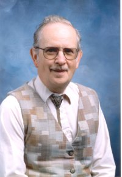 John W. Dawson, Jr. and Cheryl Dawson, <u>**Future tasks for Gödel scholars**</u>. The Bulletin of Symbolic Logic(t.a.).

> John W Dawson：[Gödel and the limits of logic](https://plus.maths.org/content/goumldel-and-limits-logic) June 1, 2006.

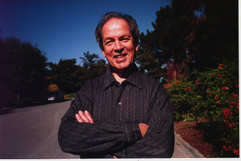 [Solomon Feferman](http://math.stanford.edu/~feferman/) (1928 – 2016):

> [The Gödel editorial project: a synopsis](http://math.stanford.edu/~feferman/papers/Goedel-Project-Synopsis.pdf) *Bull. Symbolic Logic 11 (2005) 132-149; reprinted in Kurt Gödel. Essays for his Centennial* (S. Feferman, C. Parsons and S. G. Simpson, eds.), Lecture Notes in Logic 33 (2010), Assoc. for Symbolic Logic, Cambridge University Press, 2010.

### Collected Works：

<table>
<tr>
<th><a>I</a></th>
<th><a>II</a></th>
<th><a>III</a></th>
<th><a>IV</a></th>
<th><a>V</a></th>
</tr>
<tr>
<td><a>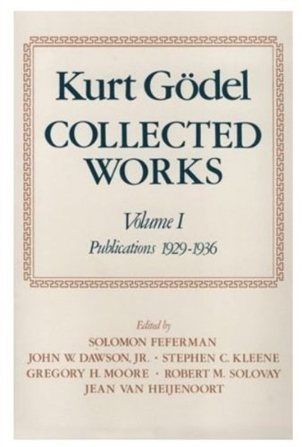</a></th>
<td><a>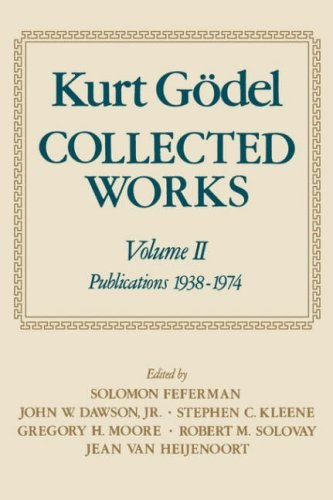</a></th>
<td><a>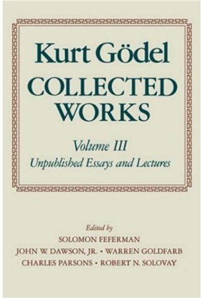</a></th>
<td><a>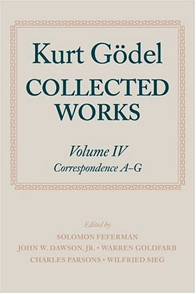</a></th>
<td><a>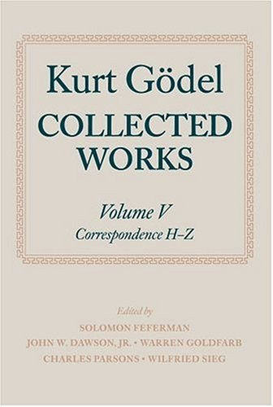</a></th>
</tr>
</table>

### Hao Wang: 

(王浩, 1921-1995)

<table>
<tr>
<th><a>A Logical Journey</a></th>
<th><a>Reflections on Kurt Gödel</a></th>
<th><a>From Mathematics to Philosophy</a></th>
</tr>
<tr>
<td><a>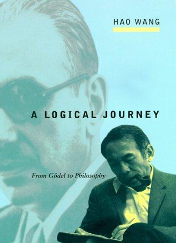</a></td>
<td><a>
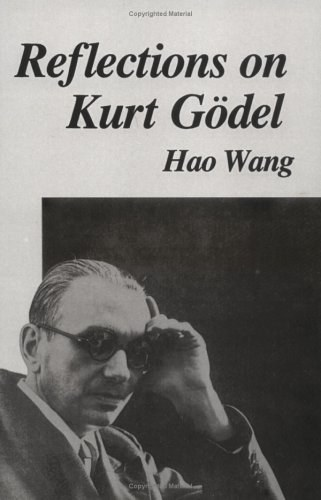
</a></td>
<td><a>
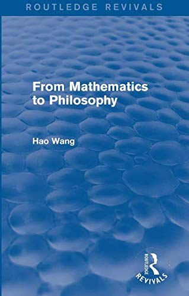
</a></td>
</tr>
</table>

******

### 中外著述:

<table>
<tr>
<th><a>逻辑之旅——从哥德尔到哲学</a></th>
<th><a>哥德尔不完全性定理</a></th>
<th><a>哥德尔</a></th>
<th><a>哥德尔证明</a></th>
<th><a>不完备性:哥德尔的证明和悖论</a></th>
<th><a>逻辑人生</a></th>
<th><a>理性的生命</a></th>
<th><a>没有时间的世界：爱因斯坦与哥德尔被遗忘的财富</a></th>
</tr>
<tr>
<td></td>
<td></td>
<td><a>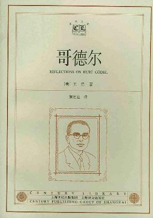</a></td>
<td><a>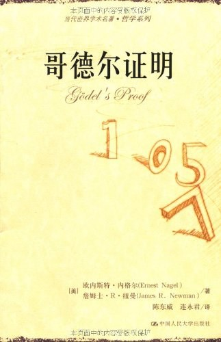</a></td>
<td><a>
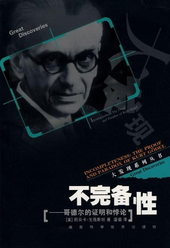
</a></td>
<td><a>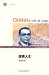</a></td>
<td><a>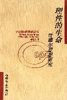</a></td>
<td><a>
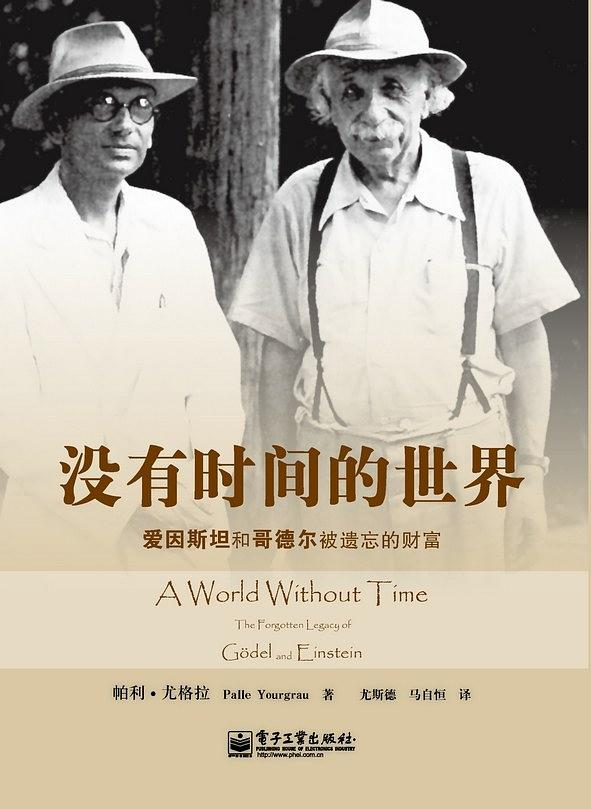
</a></td>
</tr>
</table>

<table>
<tr>
<th><a>Godel's Incompleteness Theorems</a></th>
<th><a>Kurt Gödel: Essays for his Centennial</a></th>
<th><a>After Gödel</a></th>
<th><a>Essays on Gödel's Reception of Leibniz, Husserl, and Brouwer</a></th>
<th><a>Kurt Gödel and the Foundations of Mathematics: Horizons of Truth</a></th>
<th><a>When Einstein Walked with Gödel: Excursions to the Edge of Thought</a></th>
</tr>
<tr>
<td><a>
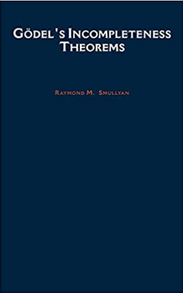
</a></td>
<td><a>
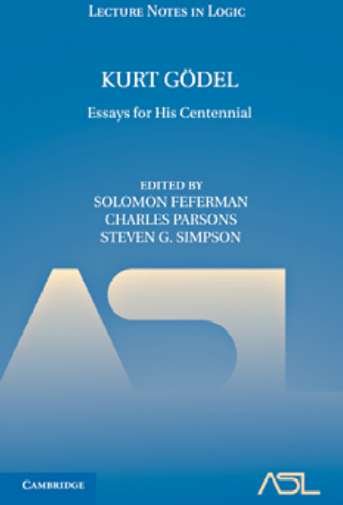
</a></td>
<td><a>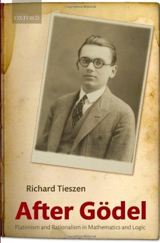</a></td>
<td><a>
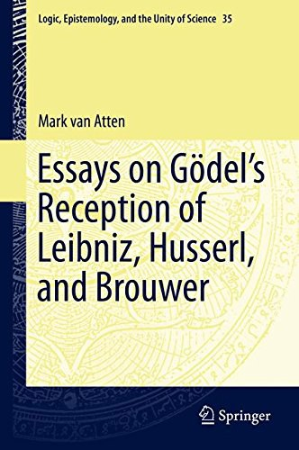
</a></td>
<td><a>
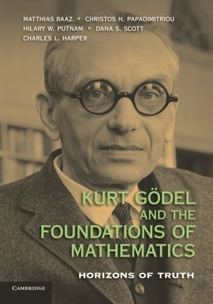
</a></td>
<td><a>
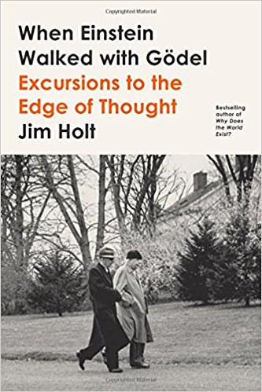
</a></td>
</tr>
</table>

### 课程：

[Godel's Incompleteness Theorem (2019-2020)](https://courses.maths.ox.ac.uk/node/42398)

### 博文：

[Kurt Gödel (1906-1978)](https://blog.computationalcomplexity.org/2006/04/kurt-gdel-1906-1978.html) 百年诞辰

[Gödel's Lost Letter and P=NP | a personal view of the theory of computation](https://rjlipton.wordpress.com)
> [Is P=NP an Ill Posed Problem?](https://rjlipton.wordpress.com/2009/07/13/is-pnp-ill-posed-problem/)

[How Gödel’s Proof Works](https://www.quantamagazine.org/how-godels-incompleteness-theorems-work-20200714/)

[The technical part of Godel’s proof](https://sbseminar.wordpress.com/2009/12/07/the-technical-part-of-godels-proof/)

赵昊彤：[哥德尔不完备定理](http://blog.sciencenet.cn/u/zhaohaotong)

刘未鹏：[康托尔、哥德尔、图灵——永恒的金色对角线](http://mindhacks.cn/2006/10/15/cantor-godel-turing-an-eternal-golden-diagonal/)

### Video：

刘晓力
>[哥德尔定理与认知科学局限](https://www.bilibili.com/video/BV1PN41197Cn)

>[哥德尔哲学: 世界的意义就在于事与愿违](https://www.bilibili.com/video/BV1K54y117Tk)

>[人类意识与机器意识的演化](https://www.bilibili.com/video/BV1WC4y1b7X2)

郝兆宽
>[哥德尔的生平](http://www.dushuren123.com/bookmov/video/share.jsp?id=1947741102)

>[不完全性定理](http://www.dushuren123.com/bookmov/video/share.jsp?id=1498409123)

>[哥德尔定理的意义](http://www.dushuren123.com/bookmov/video/share.jsp?id=81929271)